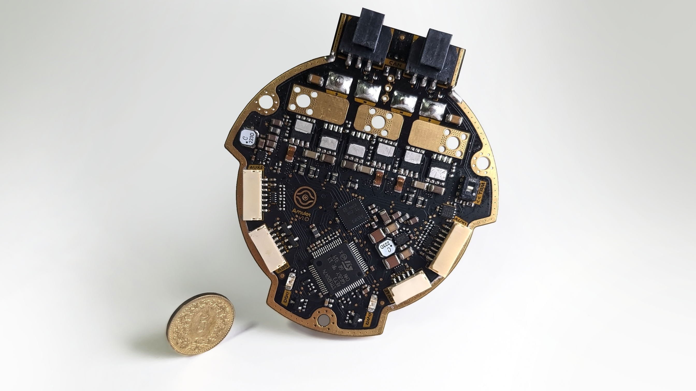
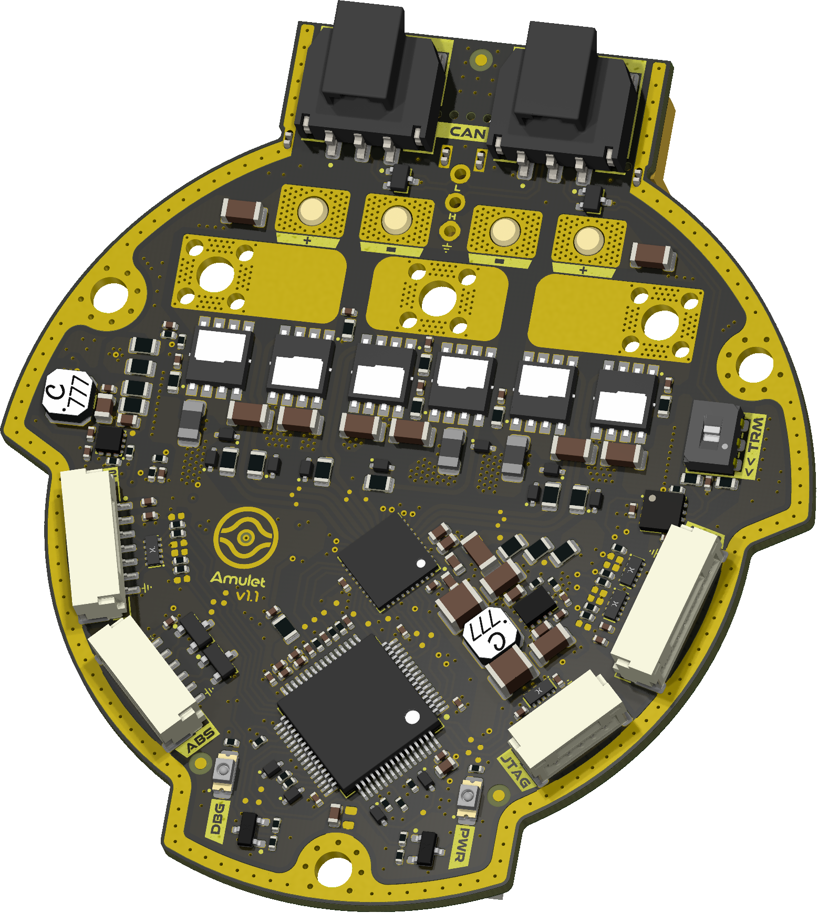
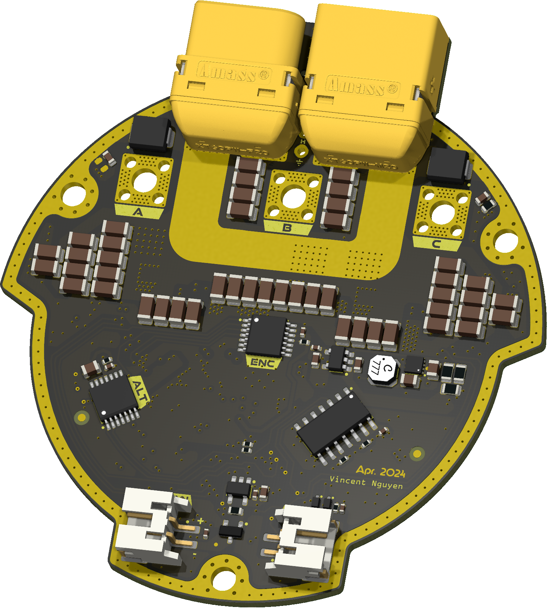

  

<h1 align="center">Λmulet Motion Controller</h1>

  

ΛMULET is a high-power brushless motor controller, compatible with the [moteus firmware](https://github.com/mjbots/moteus). It was specifically designed to be integrated in [EPFL Xplore](https://github.com/EPFLXplore)'s Legged Robot actuators.

    

***

  
&nbsp; &nbsp; &nbsp; &nbsp;
  

***

## SPECIFICATIONS

| Parameter | ΛMULET V1.0 | 
| --- | --- |
| Voltage Input | 12-44V |
| Peak Electrical Power | TBD |
| Mass | TBD |
| Peak Phase Current | 100A |
| Communication | 5Mbps CAN-FD |
| Cooling | 12V Fan |
| Positioning | 2x Onboard 14-bit Encoders |
| Control rate | 15-30kHz |
| PWM Switching Rate | 15-60kHz |
| MCU | STM32G474 |
| Dimensions | 69.67 × 76.7 mm |

***

## DIRECTORY STRUCTURE

    .
    ├─ Computations       # Misc calculations
    ├─ DXF_SVG            # Vector graphics
    ├─ HTML               # HTML files for generated webpage
    ├─ Images             # Pictures and renders
    │
    ├─ kibot_resources    # External resources for KiBot
    │  ├─ colors          # Color theme for KiCad
    │  ├─ fonts           # Fonts used in the project
    │  ├─ scripts         # External scripts used with KiBot
    │  └─ templates       # Templates for KiBot generated reports
    │
    ├─ kibot_yaml         # KiBot YAML config files
    ├─ KiRI               # KiRI (PCB diff viewer) files
    │
    ├─ lib                # KiCad footprint and symbol libraries
    │  ├─ 3d_models       # Component 3D models
    │  ├─ lib_fp          # Footprint libraries
    │  └─ lib_sym         # Symbol libraries
    │
    ├─ Logos              # Logos
    │
    ├─ Manufacturing      # Assembly and fabrication documents
    │  ├─ Assembly        # Assembly documents (BoM, pos, notes)
    │  │
    │  └─ Fabrication     # Fabrication documents (ZIP, notes)
    │     ├─ Drill Tables # CSV drill tables
    │     └─ Gerbers      # Gerbers
    │
    ├─ Report             # Reports for ERC/DRC
    ├─ Schematic          # PDF of schematic
    ├─ Templates          # Title block templates
    ├─ Testing
    │  └─ Testpoints      # Testpoints tables      
    │
    └─ Variants           # Outputs for assembly variants

***

## FIRMWARE

[Associated firmware](https://github.com/EPFLXplore/XRE_moteus/tree/amulet) is forked from the [moteus](https://github.com/mjbots/moteus) repository.

***

## CREDITS

Schematic is hugely inspired by the moteus controllers designed by Josh Pieper. They were modified to meet our own specifications, and to follow what I personally consider good layout practices.

***

## PHOTOS

    

    

    

